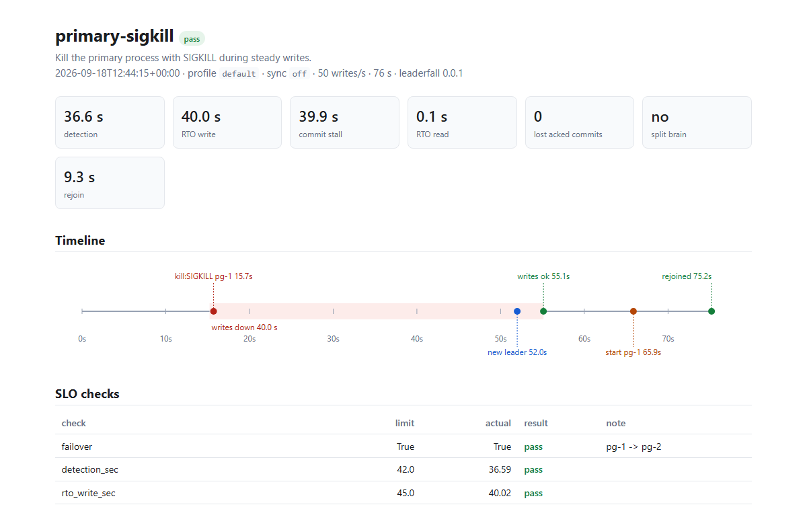
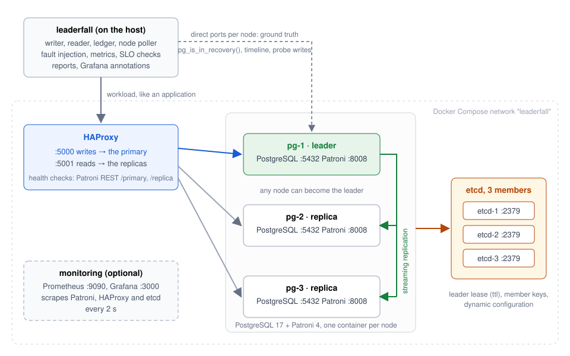
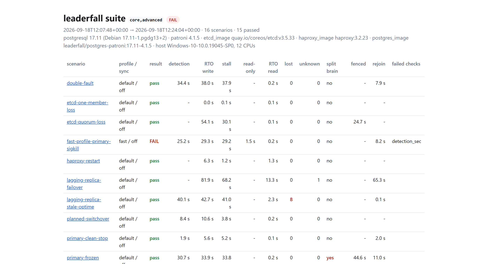
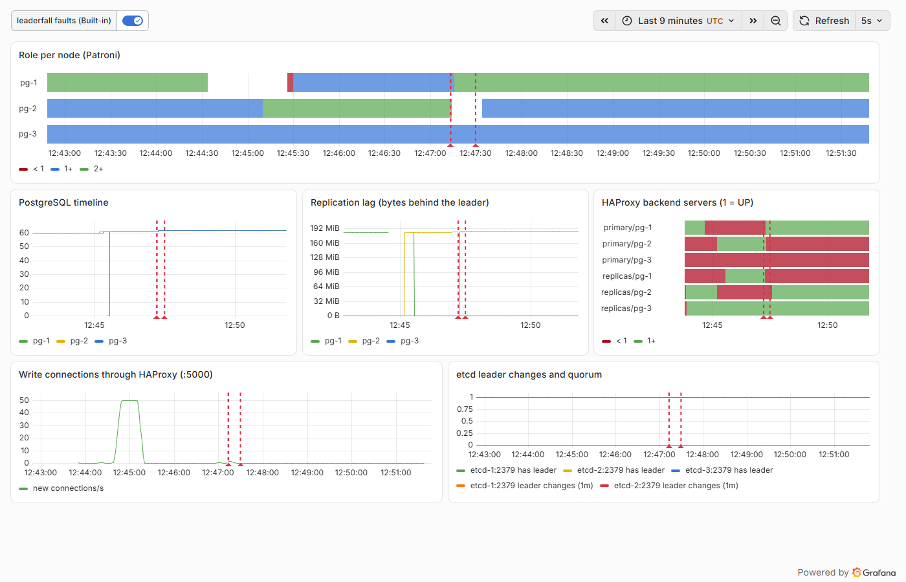

# Leaderfall

Break a PostgreSQL HA cluster on purpose, and prove with numbers that it survives.

[](https://github.com/danmorcov88/Leaderfall/actions/workflows/ci.yml)
[](https://github.com/danmorcov88/Leaderfall/actions/workflows/chaos-nightly.yml)
[](https://danmorcov88.github.io/Leaderfall/)

Leaderfall runs a real PostgreSQL 17 high-availability cluster (Patroni + etcd + HAProxy) on one machine with Docker Compose, then runs 16 automated failure scenarios against it: kill the primary, cut its network, break etcd quorum, freeze the primary past its lease, kill the sync standby, let the replicas fall behind and then kill the primary, and more.

Each scenario keeps a ledger of every commit the database confirmed, injects the fault, and measures what really happened:

- **RTO** — how long writes were down, and how long a *stall* without errors lasted
- **RPO** — whether any confirmed commit was lost, and how many "unknown" commits there were
- **Split brain** — whether two nodes ever accepted a write in the same half second
- **Fencing and rejoin** — how fast the old primary stopped taking writes, and how fast it came back as a replica

The results are checked against SLO limits and written to a report with a timeline. The suite runs in GitHub Actions on every push and every night.



## Quick start

```
git clone https://github.com/danmorcov88/Leaderfall.git
cd Leaderfall
make up      # build the image, start the cluster, wait until it is healthy (~1 min the first time)
make chaos   # kill the primary under load, measure, write a report (~70 s)
```

Then look at `reports/<timestamp>-primary-sigkill/report.html`, or run more:

```
make status                        # topology: node, role, state, timeline, lag
make chaos-all                     # the six core scenarios, about 7 minutes
make chaos-all TAG=core,advanced   # all 16, about 25 minutes
make monitoring                    # same as make up, plus Prometheus and Grafana
make down                          # stop (VOLUMES=1 also deletes the data)
.venv/bin/leaderfall list          # scenarios and their tags
.venv/bin/leaderfall run <name>    # one scenario
.venv/bin/leaderfall report --open # rebuild and open the last report
```

Needs Docker (with Compose v2), Python 3.12+ and `make`. Nothing else. Writes go to `localhost:5000`, reads to `localhost:5001`, HAProxy stats to `http://localhost:7000/`, Grafana to `http://localhost:3000/d/leaderfall`.

## Architecture



Seven containers on one Compose network: three PostgreSQL nodes managed by Patroni, a three-member etcd as the distributed configuration store, and HAProxy routing on Patroni's REST health checks. The harness runs on the host and talks to HAProxy like an application would, and to every node directly for ground truth. Optional: Prometheus and Grafana. Details in [docs/architecture.md](docs/architecture.md); the reasons in [docs/adr](docs/adr).

## Results

The table between the markers is rewritten by the nightly workflow from the last full run on a GitHub runner. The full HTML report with a timeline per scenario is at **https://danmorcov88.github.io/Leaderfall/**. Times in seconds; "reported" checks (split brain after a thaw, lost commits in the stale-optime scenario) are deliberately not enforced, and the runbook says why.

<!-- results:start -->
Last full run: 2026-09-18T13:47:24+00:00, 16/16 passed, on Linux-6.17.0-1022-azure-x86_64-with-glibc2.39 (4 CPUs).

| Scenario | Profile / sync | Result | Detection | RTO write | Commit stall | Lost acked | Unknown | Split brain | Fenced | Rejoin |
|---|---|---|---|---|---|---|---|---|---|---|
| `double-fault` | default / off | pass | 29.3 s | 31.7 s | 31.5 s | 0 | 0 | no | - | 4.7 s |
| `etcd-one-member-loss` | default / off | pass | - | 0.0 s | 0.6 s | 0 | 0 | no | - | - |
| `etcd-quorum-loss` | default / off | pass | - | 39.9 s | 24.6 s | 0 | 0 | no | 15.6 s | - |
| `fast-profile-primary-sigkill` | fast / off | pass | 16.1 s | 18.5 s | 18.4 s | 0 | 0 | no | - | 4.1 s |
| `haproxy-restart` | default / off | pass | - | 5.8 s | 0.7 s | 0 | 0 | no | - | - |
| `lagging-replica-failover` | default / off | pass | - | 80.6 s | 67.2 s | 0 | 1 | no | - | 64.4 s |
| `lagging-replica-stale-optime` | default / off | pass | 25.2 s | 28.3 s | 26.9 s | 5 | 0 | no | - | 0.0 s |
| `planned-switchover` | default / off | pass | 2.1 s | 4.7 s | 4.4 s | 0 | 0 | no | - | - |
| `primary-clean-stop` | default / off | pass | 1.6 s | 5.3 s | 5.2 s | 0 | 0 | no | - | 1.8 s |
| `primary-frozen` | default / off | pass | 32.6 s | 35.4 s | 35.5 s | 0 | 1 | yes | 46.1 s | 7.1 s |
| `primary-partition` | default / off | pass | 28.5 s | 30.8 s | 30.6 s | 0 | 0 | no | 14.5 s | 19.5 s |
| `primary-sigkill` | default / off | pass | 26.1 s | 29.4 s | 29.3 s | 0 | 0 | no | - | 5.3 s |
| `replica-loss` | default / off | pass | - | 0.0 s | 0.5 s | 0 | 0 | no | - | 2.0 s |
| `sync-mode-primary-sigkill` | default / on | pass | 28.6 s | 31.3 s | 31.1 s | 0 | 0 | no | - | 4.8 s |
| `sync-replica-loss-strict` | default / strict | pass | - | 0.0 s | 5.8 s | 0 | 0 | no | - | 1.8 s |
| `sync-replica-loss` | default / on | pass | - | 0.0 s | 5.9 s | 0 | 0 | no | - | 1.8 s |
<!-- results:end -->

How to read it: *detection* is fault → Patroni shows a new leader; *RTO write* is fault → first acked write; *commit stall* is the longest gap between two acked writes (how a lost sync standby shows up, since it produces no errors); *fenced* is fault → the old primary stops taking writes; *rejoin* is the recovery action → streaming again with lag 0. `etcd-quorum-loss` keeps etcd down for 20 s and `lagging-replica-failover` stays leaderless for 60 s on purpose, so their RTO is the length of the scenario. `primary-frozen` is measured from the freeze; the node was frozen for ~37 s and fenced 0.3 s after the thaw. The fast-profile failure in the run above was 25.2 s against a 25.0 s limit that left no margin for the poller's 0.5 s sampling; the limit is `ttl + loop_wait + 2 s` now.

**Default vs fast, async vs sync** (`primary-sigkill` under each setting; ranges over all runs on one laptop):

| | Detection | RTO write | Lost acked commits |
|---|---|---|---|
| `default` (ttl 30 / loop_wait 10 / retry_timeout 10), async | 23–37 s | 29–40 s | 0 in every run, not guaranteed |
| `fast` (ttl 20 / 5 / 5), async | 19–25 s | 22–29 s | 0, not guaranteed |
| `default`, sync | 29–35 s | 32–37 s | 0, **guaranteed** |

Sync mode does not change how long the failover takes; it changes what you can promise. The fast profile saves about 5–8 s on detection and nothing on the promotion itself. The most valuable single tuning for this workload is in neither profile: `wal_retrieve_retry_interval = 1s` would cut up to 8 s of read-only window after promotion.

## What I learned

Things you would not learn from a demo that stops at "the cluster starts". Each one is measured, reproducible with one command, and written up in a [runbook](docs/runbooks/).

1. **A hard kill costs ~30 s; a clean stop or a switchover ~5–10 s.** The difference is the leader lease. Plan maintenance; do not pull plugs.
2. **The new primary is read-only for 0–8 s after Patroni calls it the leader.** Patroni answers `/primary` with 200 as soon as it sends the promote request; PostgreSQL only acts on it when its startup process wakes from the WAL-receiver retry loop (`wal_retrieve_retry_interval`, 5 s). Writes in that window fail with `read-only transaction`. This is most of the RTO variance.
3. **Patroni's minimum `ttl` is 20 s.** A configured 15 is silently raised. The planned "fast" profile was impossible; it is 20/5/5 now.
4. **A partitioned primary fences itself in 9–15 s; a primary that lost etcd quorum takes 14–29 s.** A member that is alive but quorumless answers slowly, and Patroni's retry budget takes longer to run out than when connections are refused outright. Both are inside `ttl`, so nobody else could take the lock.
5. **A frozen primary that thaws accepts writes for about one Patroni loop.** Measured: one 0.5 s poll round with two writable primaries, then `Demoting self (immediate-nolock)`. The hardware watchdog that closes this window cannot exist in a container; see the limits below.
6. **`maximum_lag_on_failover` cannot see lag younger than one `loop_wait`.** It compares against the leader LSN last written to the DCS. With the leader killed within a loop of a bulk write, a replica missing ~16 MB was promoted and 8–109 acked commits were lost, depending on the run. With one loop of time to publish the LSN, the guard held and the cluster stayed leaderless instead.
7. **Losing the sync standby is a 6 s commit stall with zero errors.** `on` and `strict` behave the same while another replica exists. A dashboard that counts errors shows nothing.
8. **Sync mode did not change the failover time**, it changed the guarantee: 0 lost commits by construction instead of by luck.
9. **Two proxy bugs, in the lab's own config:** a fresh HAProxy assumes every server is UP until the first check (one write went to a replica after a restart; fixed with `init-state down`), and a read pool that goes empty when the last replica is promoted (17 s read outage; fixed with `use_backend primary if nbsrv(replicas) eq 0`).
10. **`unknown` commits happen.** `COMMIT` sent, connection gone, row absent. Clients must treat that as unknown, not failed, and check before retrying.

## Scenarios

Scenarios are YAML files in [`scenarios/`](scenarios/). Adding one needs no Python; see [CONTRIBUTING.md](CONTRIBUTING.md). Each has steps (`fault`, `action`, `wait_for`, `hold_sec`) and an `expect` block that overrides the limits in [`slo.yml`](slo.yml).

```yaml
name: primary-sigkill
description: Kill the primary process with SIGKILL during steady writes.
tags: [core, smoke]
cluster:
  patroni_profile: default
  synchronous_mode: false
workload:
  rate_per_sec: 50
  warmup_sec: 15
steps:
  - fault: kill
    target: primary
    signal: SIGKILL
  - wait_for: new_leader
    timeout_sec: 90
  - wait_for: writes_ok
  - hold_sec: 10
  - action: start
    target: failed_node
  - wait_for: node_streaming
    timeout_sec: 180
expect:
  failover: true
  rto_write_sec_max: 45
  lost_acked_commits_max: null   # async: report only
  split_brain: false
  final_topology: 1-leader-2-replicas
```

Faults: `kill`, `stop`, `pause`, `partition`, `switchover`, `restart_service`, `netem`, `fill_disk`. Actions: `start`, `unpause`, `heal`, `netem_clear`, `free_disk`, `write_wal`. Waits: `new_leader`, `writes_ok`, `cluster_healthy`, `node_streaming`, `node_fenced`, `no_leader`. Targets: `primary`, `sync_replica`, `any_replica`, `failed_node`, `failed_node_2`, `old_primary`, `haproxy`, `etcd-1..3`, or a node name.

| Scenario | Tag | What breaks | Runbook |
|---|---|---|---|
| `primary-sigkill` | core, smoke | primary dies hard | [runbook](docs/runbooks/primary-sigkill.md) |
| `primary-clean-stop` | core | primary stops cleanly | [runbook](docs/runbooks/primary-clean-stop.md) |
| `primary-partition` | core | primary cut off the network, then healed | [runbook](docs/runbooks/primary-partition.md) |
| `replica-loss` | core | one replica dies | [runbook](docs/runbooks/replica-loss.md) |
| `planned-switchover` | core | operator moves the leader | [runbook](docs/runbooks/planned-switchover.md) |
| `haproxy-restart` | core | the proxy restarts | [runbook](docs/runbooks/haproxy-restart.md) |
| `etcd-one-member-loss` | advanced | one etcd member dies | [runbook](docs/runbooks/etcd-one-member-loss.md) |
| `etcd-quorum-loss` | advanced | two etcd members die | [runbook](docs/runbooks/etcd-quorum-loss.md) |
| `primary-frozen` | advanced | primary frozen past ttl, then thawed | [runbook](docs/runbooks/primary-frozen.md) |
| `sync-mode-primary-sigkill` | advanced, sync | primary dies with sync replication | [runbook](docs/runbooks/sync-mode-primary-sigkill.md) |
| `sync-replica-loss` / `-strict` | advanced, sync | the sync standby dies | [runbook](docs/runbooks/sync-replica-loss.md) |
| `fast-profile-primary-sigkill` | advanced | primary dies, fast profile | [runbook](docs/runbooks/fast-profile-primary-sigkill.md) |
| `lagging-replica-failover` | advanced | replicas far behind, primary dies | [runbook](docs/runbooks/lagging-replica-failover.md) |
| `lagging-replica-stale-optime` | advanced | same, within one loop_wait | [runbook](docs/runbooks/lagging-replica-failover.md) |
| `double-fault` | advanced | primary and a replica die | [runbook](docs/runbooks/double-fault.md) |
| `wal-disk-full` | bounded-wal | the WAL volume fills | [runbook](docs/runbooks/wal-disk-full.md) |

Profiles and sync mode can be changed on a running cluster (`leaderfall up --profile fast --sync strict`): `up` patches Patroni's dynamic configuration through its REST API, so nothing restarts and no failover happens.

## Reports and monitoring

Every run writes `reports/<timestamp>-<scenario>/` with `report.html`, `report.md`, `result.json`, the event timeline, and the raw ledger, poller rounds and read samples, so any number can be recomputed. A suite adds one page with all scenarios side by side. A complete example is in [docs/examples/suite](docs/examples/suite/) (open `index.html`).



`make monitoring` adds Prometheus (2 s scrape of Patroni, HAProxy and etcd) and Grafana with a provisioned dashboard: role per node, timeline, replication lag, HAProxy backend state, write connections, etcd leader. The harness posts an annotation at every fault, action and new leader.



## Limits

**The watchdog.** Patroni's answer to a frozen or hung primary is a kernel watchdog: Patroni pets `/dev/watchdog` every loop, and if it stops, the kernel resets the whole machine before the lease can expire elsewhere. A frozen primary then reboots as a replica instead of waking up as a primary. Containers cannot use it: the device belongs to the Docker host, and Docker Desktop's VM does not even load `softdog`. This lab therefore proves the software fence (Patroni demotes on its first loop after a thaw) and measures the window the watchdog would close (about one loop). It cannot show the watchdog itself. In production, run `watchdog: mode: required`. Details in [docs/runbooks/primary-frozen.md](docs/runbooks/primary-frozen.md).

**`tc netem`** needs the `sch_netem` kernel module. Docker Desktop's WSL2 kernel does not ship it; standard Linux hosts and GitHub runners do. The lagging-replica scenarios use `docker pause` plus a bulk write instead, which works everywhere.

**`wal-disk-full`** needs a bounded `pg_wal` volume. On Docker Desktop and CI runners `pg_wal` sits on the shared host disk, and the `fill_disk` fault refuses to fill it. The scenario is written and wired but tagged `bounded-wal`; [its runbook](docs/runbooks/wal-disk-full.md) says how to run it on a host you control.

**Numbers are from one machine.** Absolute values depend on the host; the report records the host and versions. Compare runs on the same machine, and compare settings against each other rather than against a number from somewhere else.

**Not a deployment tool.** Fixed lab passwords, no TLS, one HAProxy, no backups. It is a lab and a reference.

## Documentation

- [docs/architecture.md](docs/architecture.md): what runs where, how measurement works, the scenario engine, the fault primitives
- [docs/runbooks/](docs/runbooks/): one page per scenario, with what a DBA should do in production
- [docs/adr/](docs/adr/): why Patroni + etcd + HAProxy, why Docker Compose, why Python
- [CONTRIBUTING.md](CONTRIBUTING.md): how to add a scenario, run the tests, and what the CI expects

## Development

```
make install                        # venv + dependencies
make lint                           # ruff + mypy
make test                           # unit tests, no Docker needed
.venv/bin/pytest -m integration     # checks against a running cluster
```

Future work, not planned for v0.1: a second HAProxy with keepalived and a VIP, PgBouncer in the path, pgBackRest with a "rebuild a replica from backup" scenario, a Kubernetes variant with a Postgres operator, the same harness for MySQL.

## License

Apache-2.0. See [LICENSE](LICENSE).
